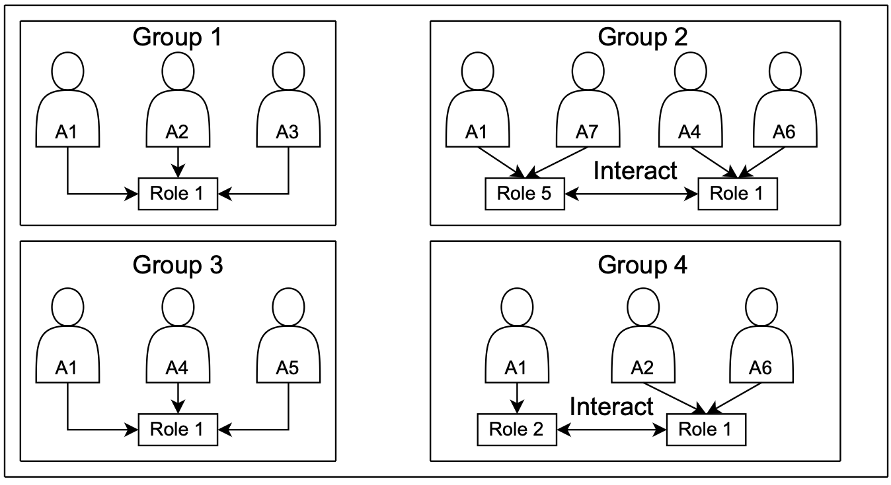
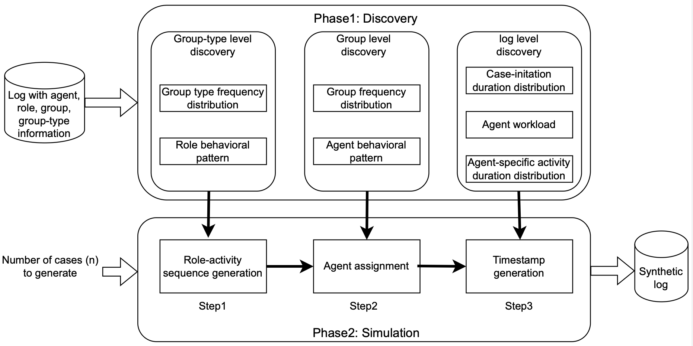

# Role Miner and Role Simulator
This project includes two main tasks:

1. Role Miner — infers group and role information for each event to construct the organizational structure.

2. Role Simulator — uses the discovered groups and roles to perform enhanced process simulation.

## Role Miner
### Input
Provide an event log that contains the following attributes:

- **case identifier**
- **activity**
- **timestamp**
- **agent instance**

### Output
The tool produces an **extended event log** enriched with:

- **group**
- **role**
- **group type**

These additional attributes allow the events to be organized into the following structure:

## Role Simulator
The input is the enriched event log containing the attributes inferred by **Role Miner**, and the output is a simulated event log that includes case identifiers, activities, timestamps, and agent instances; the following describes the steps of **Role Simulator**.

